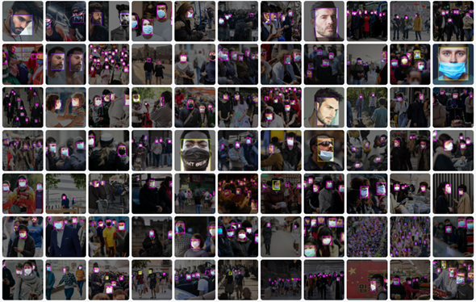
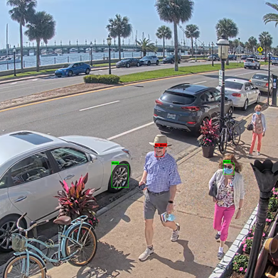
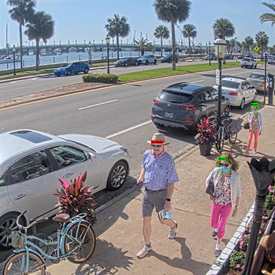

# Mask Usage Detection with Pose Estimation Support


## Project Overview
This project focuses on developing a deep learning-based system for detecting mask usage. The approach utilizes **Computer Vision** and **Neural Networks** to classify whether individuals are wearing a mask, not wearing a mask, or wearing it incorrectly.

### Key Contributions
- **Dataset Creation**: A dataset specifically designed for mask detection, containing labeled images of individuals with and without masks.
- **CNN-based Framework**: Convolutional Neural Networks (CNN) for feature extraction and classification.
- **Pose Estimation Module**: Used to refine detections and improve accuracy by leveraging body keypoints.
- **Real-time Monitoring**: Can be applied in public spaces to enforce mask-wearing policies.

## Requirements

### Basic Dependencies
```
numpy == 1.17
opencv-python >= 4.1
torch >= 1.6
torchvision
matplotlib
pycocotools
tqdm
pillow
tensorboard >= 1.14
```

### Mish Activation Function with CUDA Support in PyTorch
```
git clone https://github.com/thomasbrandon/mish-cuda
cd mish-cuda
python setup.py build install
```
If the above does not work, try this alternative:
```
git clone https://github.com/JunnYu/mish-cuda
cd mish-cuda
python setup.py build install
```

### YAML File Parsing in Python
```
pip install -U PyYAML
```

### Pose Estimation Setup
To use pose estimation within the detection process, it is recommended to have the OpenCV DNN module installed.

For installation, a CUDA-compatible GPU is required, along with the CUDA Toolkit (preferably version 10.1) and the cuDNN library (preferably version 7.5.0).

To install on a Linux environment (e.g., when using a cloud GPU system like Google Colab):
```
%cd /content
!git clone https://github.com/opencv/opencv
!git clone https://github.com/opencv/opencv_contrib
!mkdir /content/build
%cd /content/build

!cmake -DOPENCV_EXTRA_MODULES_PATH=/content/opencv_contrib/modules  \
       -DBUILD_SHARED_LIBS=OFF \
       -DBUILD_TESTS=OFF \
       -DBUILD_PERF_TESTS=OFF \
       -DBUILD_EXAMPLES=OFF \
       -DWITH_OPENEXR=OFF \
       -DWITH_CUDA=ON \
       -DWITH_CUBLAS=ON \
       -DWITH_CUDNN=ON \
       -DOPENCV_DNN_CUDA=ON \
       /content/opencv

!make -j8 install

import cv2
cv2.__version__
```
On Windows, use CMAKE and Visual Studio for installation.

## Dataset Information
- **Total Images**: 1173
- **Annotations**: 6779 labeled faces
  - 4748 with a mask
  - 1834 without a mask
  - 197 with a poorly worn mask
- **Training/Validation/Test Split**:
  - 80% Training
  - 15% Validation
  - 5% Testing
- **Data Augmentation**: Mosaicing technique used to expand the dataset.



## Model Architecture


### **Feature Extraction**
- **Convolutional Neural Network (CNN)** extracts spatial features from images.
- **Spatial Pyramid Pooling (SPP)** expands the receptive field and captures contextual information.
- **Path Aggregation Network (PAN)** enhances feature extraction by merging high-level and low-level details.

### **Pose Estimation Module**
- **2D Skeleton Detection** identifies keypoints such as nose, eyes, and ears.
- **Non-Maximum Suppression (NMS) Enhancement**
  - Filters out low-confidence detections.
  - Uses keypoints to validate mask placement.
  - Reduces false positives and improves accuracy.

## Training
To train the network, run `train.py` from the command line with the necessary arguments.

### Key Arguments
- `--weights`: Path to the weights used for model initialization
- `--cfg`: Path to the YAML file defining the model architecture
- `--data`: Path to the YAML file defining the dataset
- `--epochs`: Number of epochs for training
- `--batch-size`: Batch size for training
- `--img-size`: Image size for resizing input images
- `--resume`: Resume training from the last checkpoint
- `--cache-images`: Cache dataset images for faster training
- `--name`: Folder name for saving training data
- `--adam`: Use Adam optimizer
- `--hyp`: Path to YAML file for hyperparameter configuration

### Example: Training
```
python train.py --batch 16 --epoch 300 --data mask.yaml --cfg ./models/yolov4-csp.yaml --weights '' --name training_folder_name
```

### Example: Resume Training from Last Checkpoint
```
python train.py --batch 16 --epoch 300 --data mask.yaml --cfg ./models/yolov4-csp.yaml --weights 'runs/exp0_training_folder_name/weights/last.pt' --name training_folder_name2
```

## Detection
To run inference with the trained network, execute `detect.py` from the command line with the necessary arguments.

### Key Arguments
- `--weights`: Path to the trained model for detection
- `--img-size`: Image size for resizing input images
- `--name`: Folder name for saving detection results
- `--source`: Path to the folder containing images/videos for analysis
- `--conf-thres`: Minimum confidence threshold for predictions
- `--iou-thres`: Minimum IoU for bounding box acceptance
- `--exist-ok`: Overwrite existing folder if it already exists
- `--openpose`: Load pose estimation model into memory
- `--op-thres`: Confidence threshold adjustment for pose estimation

### Example: Detection Without Pose Estimation
```
python detect.py --weights ./runs/train/model_save_folder/weights/best.pt --conf 0.6 --source ./inference/images --name save_folder --exist-ok
```


### Example: Detection With Pose Estimation
```
python detect.py --weights ./runs/train/model_save_folder/weights/best.pt --conf 0.6 --source ./inference/images --name save_folder --exist-ok --openpose --op-thres 0.2
```


## Future Improvements
- **Enhanced Dataset Robustness**: Further balancing and augmentation to improve model generalization.
- **Person Re-identification**: Prevents duplicate counts in multi-camera environments.
- **Social Distancing Detection**: Additional functionality to monitor safety measures.
